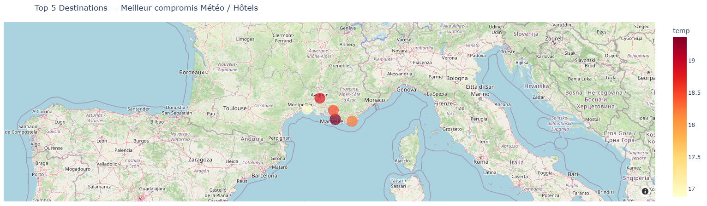
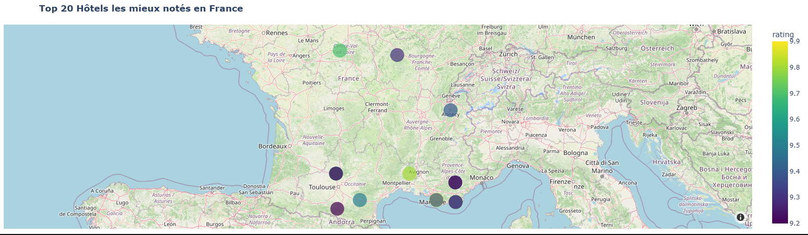

# Plan your trip with Kayak

**Auteur :** Aïcha FATHELLAH  
**Formation :** Fullstack Data Engineering — Jedha  
**Certification :** CSDS (Concepteur et Développeur en Science des Données)

---

## Description

Ce projet construit un pipeline ETL complet pour aider l'équipe marketing de [Kayak](https://www.kayak.com) à recommander les meilleures destinations de vacances en France.

**Problématique :** 70 % des utilisateurs de Kayak souhaitent plus d'informations sur leur destination avant de réserver. L'objectif est de fournir une recommandation basée sur des données réelles de météo et de qualité hôtelière.

**Résultat final :** deux cartes interactives affichant le Top 5 des destinations et le Top 20 des hôtels les mieux notés, alimentées par un pipeline de données automatisé.

---

## Architecture du pipeline

```
Géocodage (Nominatim)
        |
        v
API Météo (OpenWeatherMap)
        |
        v
Scraping Hôtels (Booking.com / Selenium)
        |
        v
Nettoyage & Scoring (Pandas)
        |
        v
Data Lake (AWS S3)  -->  Data Warehouse (AWS RDS / PostgreSQL)
        |
        v
Visualisation (Plotly Express / Mapbox)
```

---

## Technologies utilisées

| Catégorie | Technologie |
|---|---|
| Géocodage | Nominatim (OpenStreetMap) via `geopy` |
| Données météo | API OpenWeatherMap (endpoint Forecast) |
| Scraping | `Selenium` + `BeautifulSoup` (Chrome headless) |
| Traitement des données | `Pandas`, `NumPy` |
| Stockage Cloud | AWS S3 (Data Lake) via `boto3` |
| Base de données | AWS RDS / PostgreSQL via `SQLAlchemy` |
| Visualisation | `Plotly Express` (cartes Mapbox interactives) |
| Sécurité | `python-dotenv` (variables d'environnement) |

---

## Structure du projet

```
Projet-Planifiez votre voyage avec Kayak/
│
├── 01-Plan_your_trip_with_Kayak_Projet.ipynb  # Notebook principal
│
├── config/                                     # Fichiers de configuration (non versionnés)
│   ├── aws.env                                 # Clés AWS (non versionné)
│   └── openweather.env                         # Clé API météo (non versionnée)
│
├── aws.env.example                             # Modèle de configuration AWS
├── openweather.exemple                         # Modèle de configuration OpenWeather
│
├── villes_coords.csv                           # 35 villes + coordonnées GPS
├── villes_meteo_coords.csv                     # Villes + données météo
├── hotels_booking_35_villes.csv                # Données brutes hôtels (scraping)
├── hotels_cleaned_full.csv                     # Données hôtels nettoyées
├── villes_scores_aggregated.csv                # Score moyen par ville
├── kayak_final_enriched_data.csv               # Dataset final (météo + hôtels + score)
│
└── README.md
```

---

## Résultats

### Top 5 des destinations — Meilleur compromis Météo / Hôtels



### Top 20 des hôtels les mieux notés



---

## Reproduire le projet

### Prérequis

- Python 3.10+
- Google Chrome installé
- Un compte AWS (pour les étapes S3 et RDS)
- Une clé API OpenWeatherMap (compte gratuit sur [openweathermap.org](https://openweathermap.org))

### Installation

```bash
pip install selenium webdriver-manager boto3 sqlalchemy psycopg2-binary plotly geopy python-dotenv
```

### Configuration

Créer un dossier `config/` et y placer deux fichiers :

**`config/openweather.env`**
```
OPENWEATHER_API_KEY=ta_cle_ici
```

**`config/aws.env`**
```
AWS_ACCESS_KEY_ID=ta_cle_ici
AWS_SECRET_ACCESS_KEY=ta_cle_secrete_ici
S3_BUCKET_NAME=nom_de_ton_bucket
AWS_REGION=eu-west-3
RDS_USERNAME=admin
RDS_PASSWORD=ton_mot_de_passe
RDS_HOSTNAME=ton-instance.xxxx.eu-west-3.rds.amazonaws.com
RDS_PORT=5432
RDS_DB_NAME=postgres
```

### Exécution

Ouvrir `01-Plan_your_trip_with_Kayak_Projet.ipynb` et exécuter les cellules dans l'ordre.

Les cellules 6 (S3) et 7 (RDS) nécessitent un compte AWS actif. Les autres cellules fonctionnent en local sans AWS.

---

## Points techniques notables

- **Protection des clés** : aucune clé API ou credential AWS n'apparaît en clair dans le code — tout est chargé via `python-dotenv` depuis des fichiers `.env` exclus du versionnement Git
- **Résilience du scraping** : checkpoint CSV sauvegardé après chaque ville pour éviter la perte de données en cas d'interruption
- **Contournement anti-bot** : utilisation de Selenium en mode headless avec scroll progressif pour déclencher le lazy-loading de Booking.com
- **Pipeline ETL complet** : séparation claire entre Data Lake (S3, données brutes) et Data Warehouse (RDS, données structurées et requêtables)
