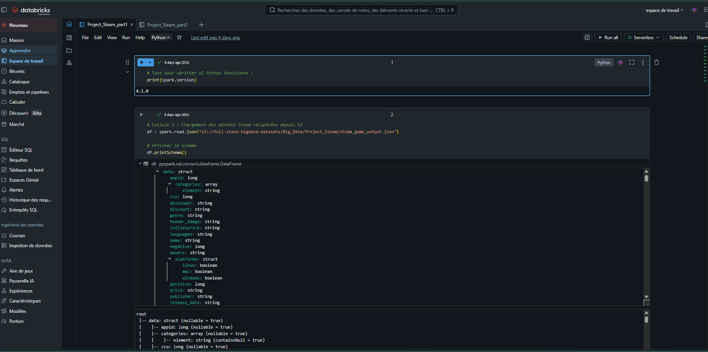
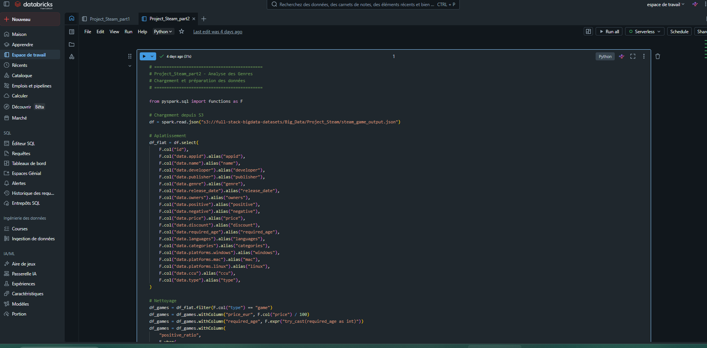

# Projet Steam - Analyse exploratoire de la plateforme de jeux vidéo

## Contexte

Analyse exploratoire complète (EDA) des jeux disponibles sur Steam, réalisée pour le compte d'**Ubisoft** afin d'orienter la stratégie de lancement d'un nouveau jeu vidéo.

---

## Dataset

| Propriété | Valeur |
|-----------|--------|
| Source | AWS S3 |
| URL | `s3://full-stack-bigdata-datasets/Big_Data/Project_Steam/steam_game_output.json` |
| Format | JSON semi-structuré (schéma imbriqué) |
| Volume | 55 690 jeux après filtrage |

---

## Stack technique

`PySpark 4.1` - `Databricks Free Edition` - `AWS S3`

---

## Structure du projet

```
2-Steam/
├── Project_Steam_part1.ipynb  - Notebook 1 : Analyse Macro
├── Project_Steam_part2.ipynb  - Notebook 2 : Genres et Plateformes
├── images/                    - Captures Databricks
└── archive/                   - Fichiers de travail
```

---

## Consulter les notebooks

### Fichiers HTML (recommandé)
- [Notebook 1 - Analyse Macro](./archive/Project_Steam_part1.html)
- [Notebook 2 - Genres et Plateformes](./archive/Project_Steam_part2.html)

---

## Apercu des notebooks dans Databricks





---

## Résultats clés

### Macro
| Indicateur | Résultat |
|------------|----------|
| Éditeur le plus prolifique | Big Fish Games - 422 jeux |
| Ubisoft | 9ème éditeur - 127 jeux |
| Année record | 2021 - 8 823 sorties |
| Langue dominante | English - 55 116 jeux |
| Jeux tous publics | 98.8% des jeux |

### Genres
| Indicateur | Résultat |
|------------|----------|
| Genre le plus représenté | Indie - 39 681 jeux (marché saturé) |
| Genre le plus lucratif | Action - 3 milliards de propriétaires |
| Meilleur ratio d'avis | Game Development - 82% |

### Plateformes
| Plateforme | Part du marché |
|------------|---------------|
| Windows | environ 100% |
| Mac | 23% |
| Linux | 15% |

---

## Recommandations pour Ubisoft

- **Genre** : Action / Adventure - le plus lucratif avec 3 milliards de propriétaires
- **Plateforme** : Windows en priorité, Mac recommandé pour se différencier
- **Prix** : Entre 10 et 20 euros - zone optimale du marché
- **Langues** : EN + DE + FR + RU

## Stack technique


---

## Certification

> **Projet de certification — Bloc #2**
>
> Ce projet fait partie des livrables obligatoires pour la validation du **Bloc #2 : Analyse exploratoire des données** du certificat d'**Ingénieur en Apprentissage Automatique** (Concepteur Développeur en Science des Données).
>
> **Compétences évaluées et validées ici :**
> * Pertinence de la méthodologie de nettoyage, de traitement de volumes importants (fichiers JSON complexes) et de préparation des données.
> * Choix et efficacité du traitement parallélisé appliqué pour l'analyse statistique distribuée.
> * Clarté, simplicité des graphiques construits sur Databricks et pertinence business des recommandations formulées pour l'éditeur.